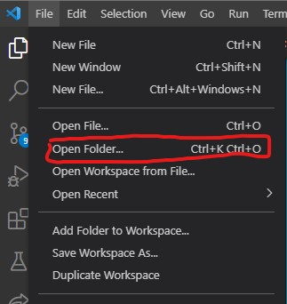
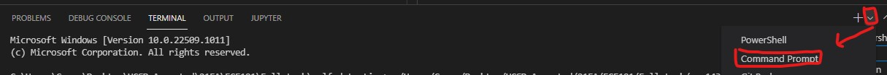
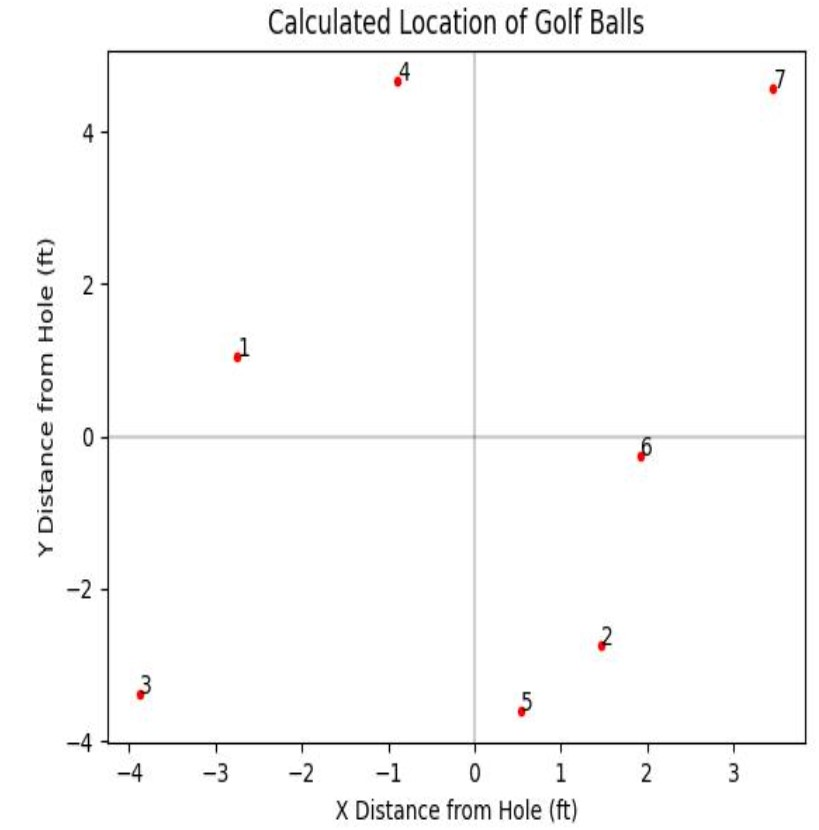
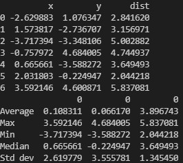
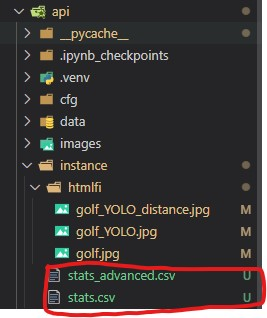

# Callaway Golf Green Measurement System Web App

## Installation Guide

### Requirements
* Visual Studio Code (VS Code): https://code.visualstudio.com/
* git: https://git-scm.com/downloads
* Node.js: https://nodejs.org/en/ 

### Build Project 

1. Open terminal (from command prompt or within VS Code), navigate to the folder where the project will be built by ```cd $ROOT ```, replace ```ROOT``` with the folder path.
2. Type the following command to see if the requirements are met. 
```bash 
npm
git
```
&nbsp;&nbsp;&nbsp;&nbsp;&nbsp;&nbsp; If you see outputs like this then you have the requirements satisfied. 
```
C:\Users\Gaopo>npm
npm <command>

Usage:

npm install        install all the dependencies in your project
npm install <foo>  add the <foo> dependency to your project
npm test           run this project's tests
npm run <foo>      run the script named <foo>
npm <command> -h   quick help on <command>
npm -l             display usage info for all commands
npm help <term>    search for help on <term> (in a browser)
npm help npm       more involved overview (in a browser)

C:\Users\Gaopo>git
usage: git [--version] [--help] [-C <path>] [-c <name>=<value>]
           [--exec-path[=<path>]] [--html-path] [--man-path] [--info-path]
           [-p | --paginate | -P | --no-pager] [--no-replace-objects] [--bare]
           [--git-dir=<path>] [--work-tree=<path>] [--namespace=<name>]
           [--super-prefix=<path>] [--config-env=<name>=<envvar>]
           <command> [<args>]
```

2. Run following command:

```bash
git clone https://github.com/anwarhsu/golf-detection.git
cd golf-detection
npm install
npm start
```

&nbsp;&nbsp;&nbsp;&nbsp;&nbsp;&nbsp; These commands will have all the codes installed and ready to run.

3. Make a virtual environment, then activate the virtual environment 
    ```bash
    python -m venv golf_detect
    golf_detect\Scripts\activate.bat
    ```
    If you did it correctly, you should see the environment before the command line, like: 
    ```bash 
    (golf_detect) C:\Users\Gaopo>
    ```

4. Backend requirements: 

    4.1 Navigate to /api folder
    ```bash
    cd api
    ```
    4.2 Download the weights used for YOLOv3 model: [google drive link](https://drive.google.com/file/d/1B519piHVWGLYfzDS1By_8OI9UzCFqtvy/view?usp=sharing) and move the file to a /weights folder. You can run the following command, then drag the **test.weights** file to the /weights folder
    ```bash 
    mkdir weights
    ```
    4.3 Install all packages needed by 
    ```bash
    pip install -r requirements.txt
    ```

# Usage

1. Open the "golf-detection" folder in VS Code 

 

2. In terminal, run the frontend by typing: 
    ```bash
    ..\golf_detect\Scripts\activate.bat
    npm start
    ```
    In the above block, the first command activates the environment and the second command will start the frontend of the web on localhost:3000.
3. Open a new terminal as the screenshot below: 



Make sure that this terminal is also running in the environment for the project; if not run `..\golf_detect\Scripts\activate.bat`, then run the backend by typing:

```bash
cd api && python app.py
```

Now the website is up and we can start testing different ball configuration. Here it's recommended to split your screen to view both the websites and the VS code terminal simultaneously, so you can see outputs from the terminal.

4. Upload 1st image in jpg format, then click **submit**, then go back to **localhost:3000** and refresh the page 
5. Click **YOLO DETECT**, wait about 5~10 seconds for program to run, and refresh the page, now you should see the prediction image when scrolling down
6. If the flag is not detected, manually drag the bounding box for the flag by:

    6.1.  In the original image (top image), first click what will be the top left of the box and then click the bottom left of the box.  In the algorithm, the bottom line of the box is creating the location of the hole in the y-axis.  The x-axis of the hole is the midpoint of the bottom line.  If you mis-click, just refresh and drag the bounding box again. 

    6.2. Click **EDIT**, wait about 5~10 seconds for program to run, and refresh the page to see the result on the prediction image.
7.  If any wrong detections are made, go to the file explorer tree, find folder `api/instance/` and edit the file `box1.txt` or `box2.txt` depending on which angle of the image is. You need to delete the row of the wrong object detected. To decide which row represents the bounding box to the misclassified object, the first two columns represent the x,y coordinates of the bounding box in the image relative to the image width and height.

8. Repeat step 4-7 for 2nd image.
9. Click **distance calc** to obtain a graph representation of the representation. Refresh the page and scroll down to see the visualization like the following:


    A raw text output is also generated in the terminal: 
    

    Note that these text outputs are also stored as csv files in `api/instance/` folder. You can move or store them elsewhere easily. 


    9.1 If you want to change the weights of two images's impact on x-y axis coordinate, go to file `api/distance.py` and change the line 291 ```mainProp``` to the weight of the first image you want it to be (default:0.61)

10. In one session, you can keep repeating step 4~9 for each trial of diffrent ball configurations. When you are done, you can exit the environment by typing `deactivate` or directly close the terminal.

# Other Resources

This project was bootstrapped with [Create React App](https://github.com/facebook/create-react-app). More commands with React App can be found [Here](./doc/ReactApp.md)


